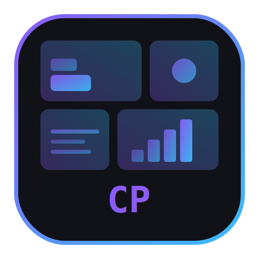

<p align="center">
  
</p>

<h1 align="center">Claude Panel</h1>

<p align="center">
  Local dashboard and control panel for Claude Code
</p>

<p align="center">
  <a href="https://www.npmjs.com/package/claude-panel"></a>
  <a href="https://github.com/codes71/claude-panel/blob/main/LICENSE"></a>
  
  <a href="https://github.com/codes71/claude-panel"></a>
</p>

---

Manage configuration, plugins, commands, MCP servers, skill providers, and multiple Claude Code instances from a single UI.

## Features

- **Dashboard** -- token breakdown, top consumers, optimization recommendations
- **Settings** -- environment variables, hooks, behavioral toggles
- **Plugin Manager** -- list, enable/disable, and inspect installed plugins with token estimates
- **MCP Servers** -- add, remove, and toggle Model Context Protocol servers
- **Reliability** -- MCP Doctor diagnostics, MCP health snapshots, CLAUDE.md drift feed, provider provenance lock view
- **CLAUDE.md Editor** -- recursive tree scanner with live editing for global and per-project files
- **Custom Commands** -- full CRUD for slash commands with namespace grouping
- **Skill Providers** -- add git-based providers, discover and install skills
- **Config Bundles** -- export, validate, and dry-run apply configuration-as-code bundles
- **Skill Catalog** -- unified view of installable skills across all providers
- **Marketplace** -- browse and install plugins from marketplaces
- **Claude Code Router** -- view provider status, models, routing rules
- **Multi-Instance** -- switch between multiple `~/.claude*` configuration profiles
- **Visibility** -- overview of commands, agents, and memory files

## Platform Support

| Platform | Status |
|----------|--------|
| Linux    | Supported |
| macOS    | Supported |
| Windows  | Supported |

## Prerequisites

- [Node.js](https://nodejs.org/) 18+
- [Python](https://www.python.org/) 3.12+
- [`uv`](https://docs.astral.sh/uv/) (Python package manager)

## Install

```bash
npm install -g claude-panel
```

Or run without installing globally:

```bash
npx claude-panel
```

## Usage

```bash
claude-panel
```

By default, Claude Panel tries port `8787`. If that port is busy, it automatically selects a free port and prints the URL.

### CLI Options

| Flag | Description |
|------|-------------|
| `--port <number>` | Use a specific port (fails if busy) |
| `--no-open` | Don't open the browser automatically |
| `--help` | Show usage information |

### Environment Variables

| Variable | Description | Default |
|----------|-------------|---------|
| `CLAUDE_PANEL_PORT` | Override the default port | `8787` |
| `CLAUDE_PANEL_SCAN_ROOTS` | Comma-separated scan roots for CLAUDE.md discovery | Home directory |

## Troubleshooting

**`uv` not found**
Install uv: `curl -LsSf https://astral.sh/uv/install.sh | sh`

**Python not found**
Ensure `python3` (or `python`) 3.12+ is installed and on your PATH.

**Port already in use**
Either let Claude Panel auto-select a free port, use `--port <number>` with a different port, or set `CLAUDE_PANEL_PORT` to change the default.

**First run is slow**
On first launch, `uv` creates a Python virtual environment and installs backend dependencies. Subsequent starts are fast.

## Local Development

Build frontend assets into the backend static directory:

```bash
npm run build:frontend
```

Run the packaged launcher locally:

```bash
npm start
```

Start both backend and frontend dev servers (hot-reload):

```bash
bash scripts/dev.sh
```

See [CONTRIBUTING.md](CONTRIBUTING.md) for full development setup and contribution guidelines.

## Publishing

The `prepack` lifecycle script automatically runs `npm ci` in the frontend directory and builds static assets, so `npm publish` produces a ready-to-run package.

## License

[MIT](LICENSE)

## Disclaimer

Claude Panel is an independent open-source project and is not affiliated with, endorsed by, or officially connected to Anthropic, PBC. "Claude" is a trademark of Anthropic.
